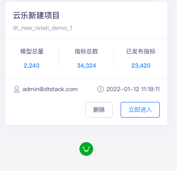

# 2025-8-19

## 数据沙箱：

### 数据集管理
1.  改为：数据集广场
2.  增加创建数据集 按钮  
3.  上传 数据集 页面没有实现
4.  增加  宜兴城市污水厂 水质数据数据集
5.  增加  按组织
6.  缺少  数据集 详情页 
7.  数据集详情  增加 “探查” 按钮  

### 数据目录

1.  数据目录详情页： 基本信息同 列表；
2.  数据预览 增加  按组织， 按时间范围  预览功能， 只返回前10、20、50条数据；
   
### 数据申请
1.  数据申请，增加  数据预览功能   和 字段筛选功能；
2.  数据探查 调整到 smartbi  数据分析页面

### 数据公开

1.  页面 未实现
2.  数据申请，增加  数据预览功能   和 字段筛选功能；
3.  数据探查 调整到 smartbi  数据分析页面

## 模型实验室：

### 模型广场

1.  下载次数 改为 试用次数
2.  模型 详情页面 增加 “试用” 按钮
3.  增加 “创建模型”  按钮， 同 新建模型

### 模型试用

1.  增加 “试用”  按钮
2.  模型试用  菜单 调整到  模型广场后
3.  只能看见 自己 试用的 模型情况

### 模型开发

1.  增加子菜单： 机器学习模型、智能体、数据规则模型
2.  缺少  新建 版本的 操作
3.  增加  发布  按钮

### 模型发布

1.  隐藏 模型发布 菜单

### 模型部署

1.  选择 模型，模型版本 提交 发布申请，发布范围，进行 审核

### 模型评估

1.  可以参考 所有的模型试用 记录
2.  增加  部署 按钮

## 后台管理

###  审核管理

1.  同工作流审核

### 脱敏管理（敏感数据管理）

1.  右侧树  同  数据目录 树
   
##  业务演示

1.  以“外回流推理”  机器学习模型为例
2.  以“污泥工况”   智能体为例
3.  数据规则模型
4.  集成 smartbi  进行数据分析
5.  

# 2025-8-20

##  去除 页眉 采用和 数据中台 等类似的风格

###  数据沙箱

####  数据集广场

1.  创建数据集、上传数据集 按钮 先去掉
2.  数据集详细： 数据集浏览 改为：  中文表头
3.  数据集： 增加 到期时间字段

####  数据申请

1.  增加 工作流页面

####  数据公开

1.  增加 工作流页面

###  模型实验室

#### 模型广场

1.  机器学习、python、a2o 改为 

2.  增加 组织树；
   
###  模型开发

1.  修改 新建模型的 页面

####  模型试用界面

1.  修改模型试用界面

####  模型部署：

1.  修改 模型部署的 详情页